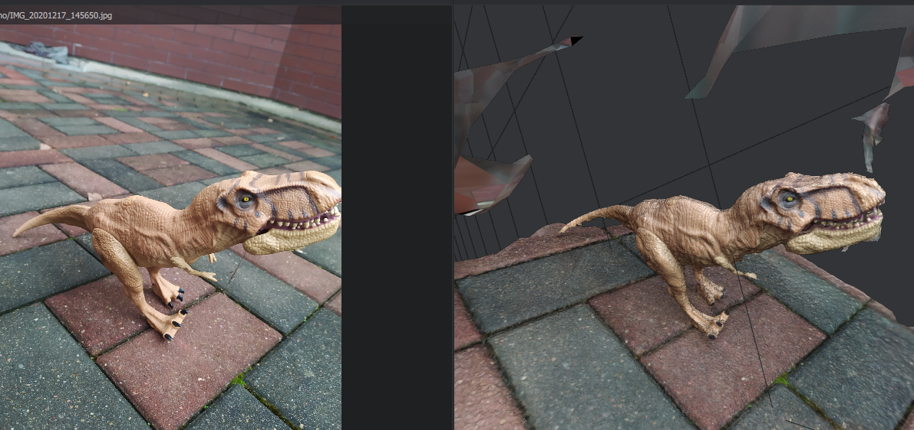
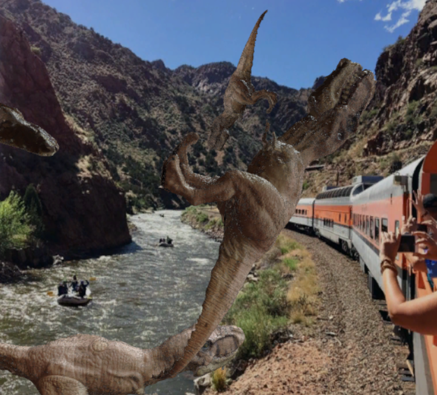
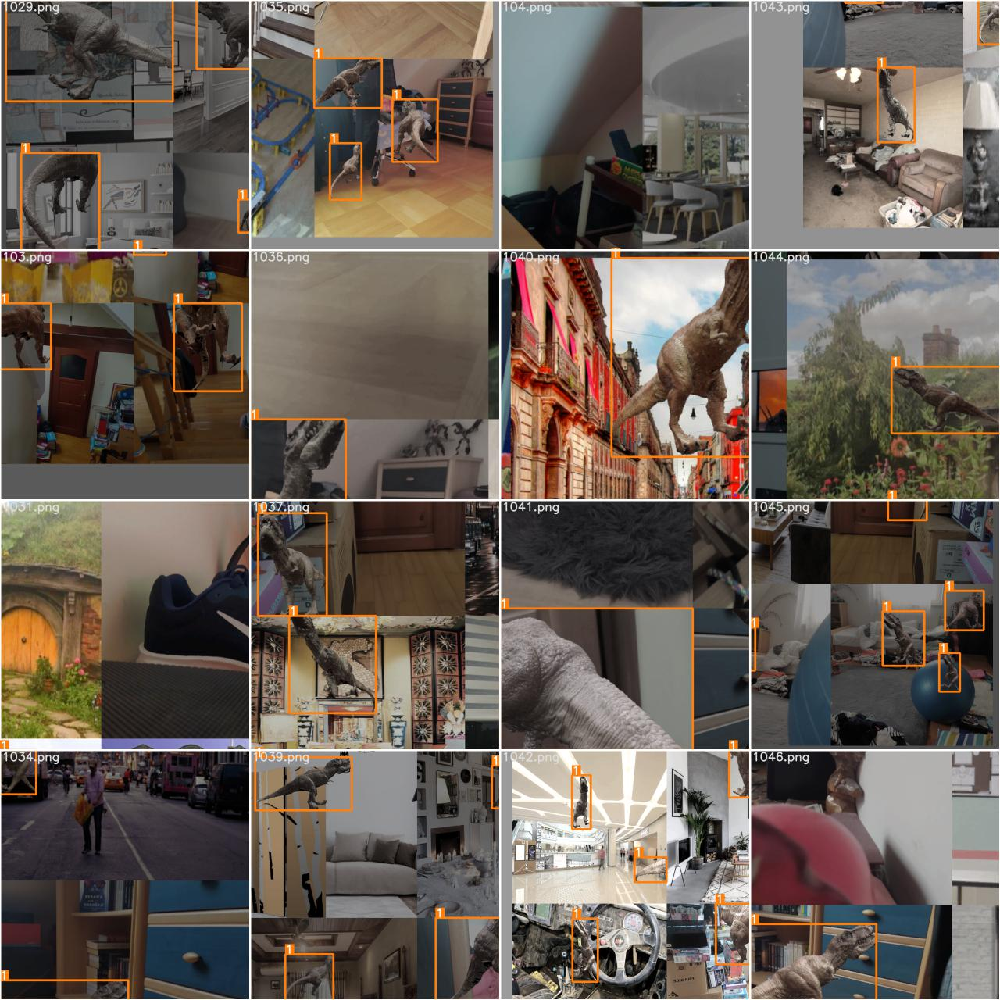
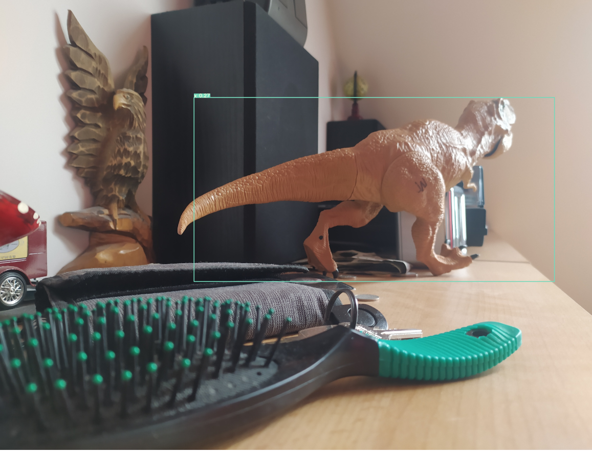
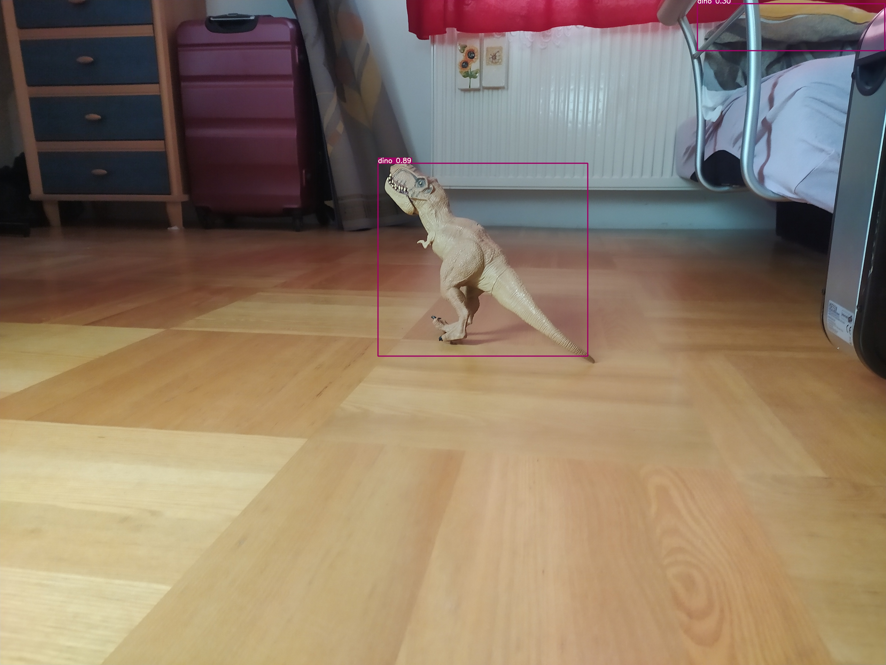

# Sim2real Object Recognition
Scan real life objects with photogrammetry -> Generate synthetic dataset in simulation using Unity Perception Tools -> train with tiny YOLO -> port to Arduino based vehicle with Nvidia Jetson

## Photogrammetry
Software used:
###### Meshroom (https://github.com/alicevision/meshroom)

## Synthetic dataset generation
Software used: 
###### Unity Perception Tools (https://github.com/Unity-Technologies/com.unity.perception)

## YOLO
Model used: 
###### YOLOv3 tiny (https://github.com/ultralytics/yolov5)

## Prediction examples

